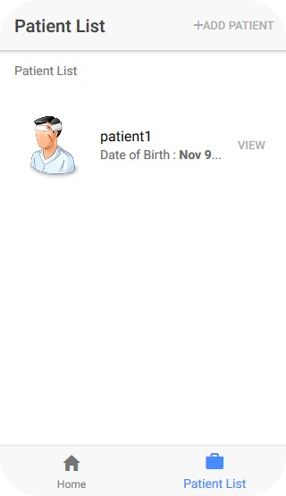

# Infant-Vaccination-System
using Typescript

This is my BCA Project April-2018

Intially you need to download and install NodeJS and AngularJS
It is coded using Typescript as frontend with the help of HTML and CSS
And used Firebase as database which is freely provided by google.

You can leave your comments for any queries.

## Languages and tools used

  &nbsp;
  &nbsp;
  &nbsp; 

 

### Screenshots:

